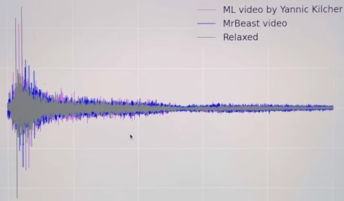

# Reading Brain Waves with hacked Neco Mimi Brainwave Cat Ears

The Neco mimi Brainwave Cat Ears consist of a brainwave sensor and a pair of motorized cat ears. These motorized ears are controlled by brain waves, which adjust their position based on the wearer's mood.

## Hacking the Neco mimi
### 1. Disassembly 

### 2. Modifying the circuitry

### 3. Listening in on the TX data

### 4. Putting it back together

  

### Testing

### Results
Reading brain waves with Neco Mimi sensor while watching videos. Measuring the focus level from the sensor data.

  

